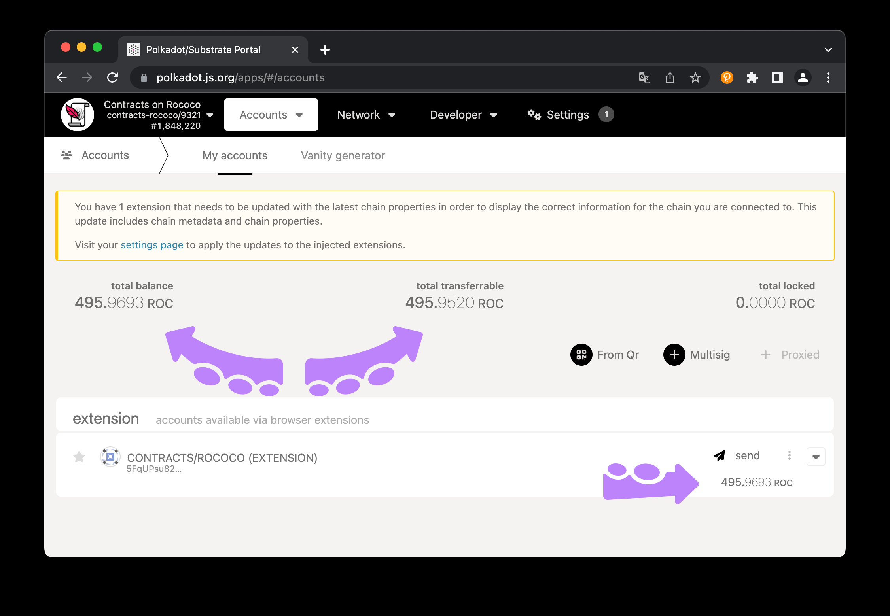

# What you should do now (1)

## Install Rust stable

[Installation instructions here](https://www.rust-lang.org/tools/install)

## Install `cargo-contract`

```bash
rustup component add rust-src.
cargo install --force --locked --version 2.0.0-rc.1 cargo-contract 
```

If successful you should see an output when executing: `cargo contract --help`.

## Install `polkadot-js` Browser Extension

[Click here.](https://polkadot.js.org/extension/)

## Create Account in Browser Extension

[See the guide here.](https://support.polkadot.network/support/solutions/articles/65000180529)

## Get `ROC` Tokens via Faucet

Join Matrix room: [#rococo-faucet:matrix.org](https://matrix.to/#/#rococo-faucet:matrix.org).

Write:
```
!drip YOUR_SS_58_ADDRESS:1002
```

You can see the funds under
[the "Accounts" tab for the `Contracts` parachain](https://polkadot.js.org/apps/?rpc=wss%3A%2F%2Frococo-contracts-rpc.polkadot.io#/accounts).

