# What you should do now (2)

## Clone `squink-splash-beginner`

```bash
git clone https://github.com/paritytech/squink-splash-beginner.git
cd squink-splash-beginner/
```

## `lib.rs`: change line 28 

Set your favorite numbers between 0-15.

## Build your Player Contract

Execute:

```bash
cargo contract build --release
```

Your contract will be written here:

```
target/ink/basic_player.contract
```

## Upload & Instantiate Your Player

[Open Contracts UI here](https://github.com/paritytech/contracts-ui).

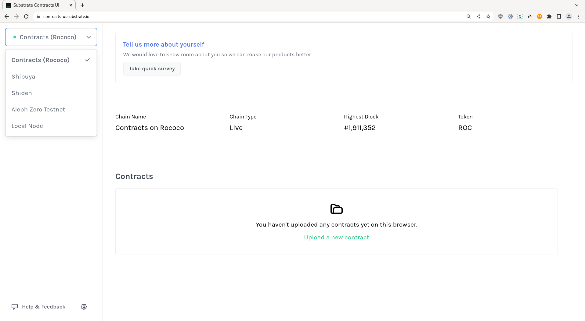

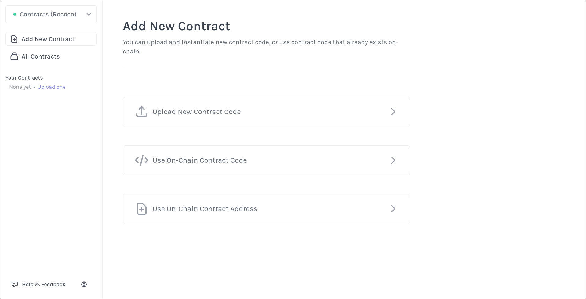

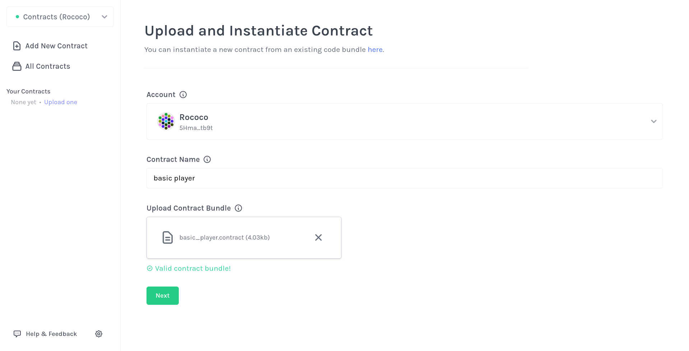

Upload `target/ink/basic_player.contract`:

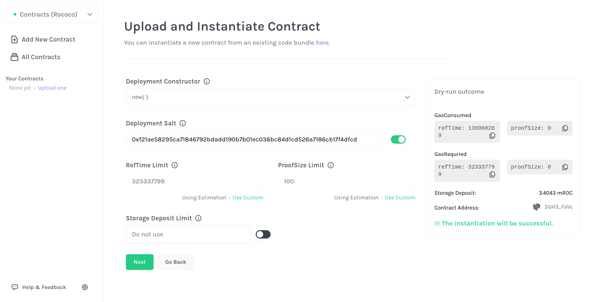

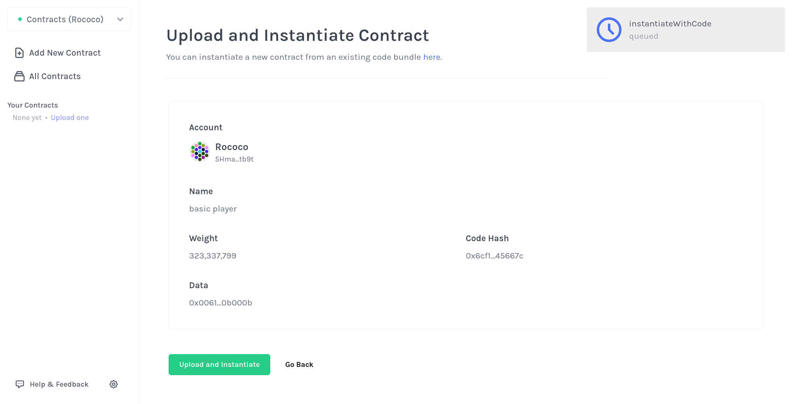

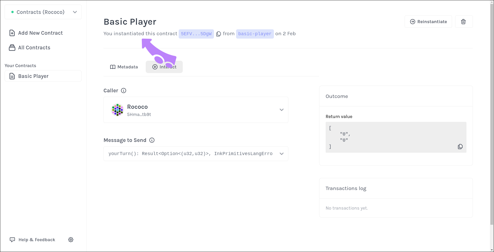

## Upload & Instantiate `game-metadata.json`

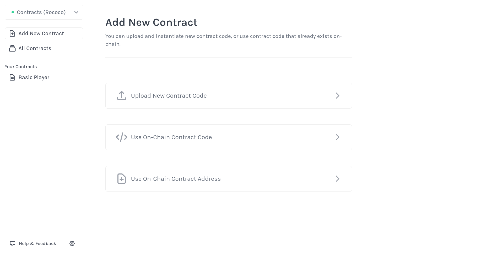

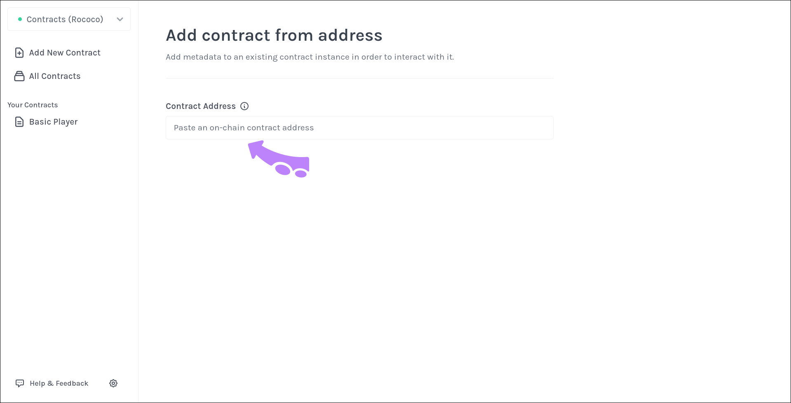

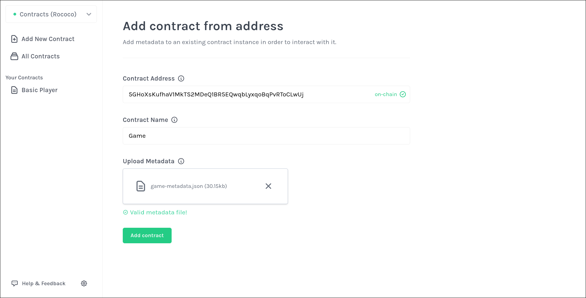

## Register your player

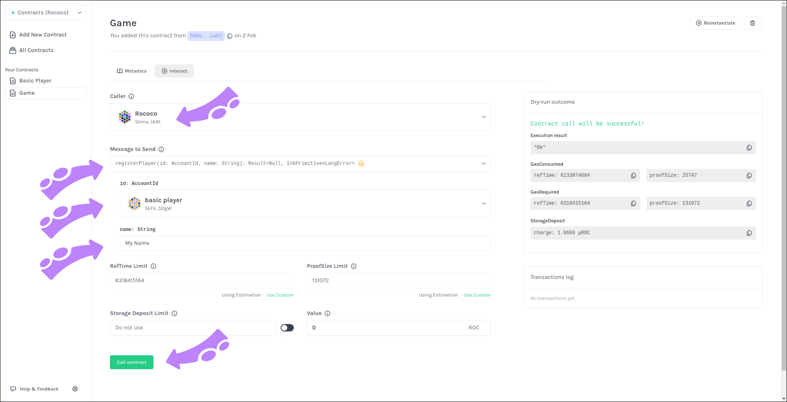

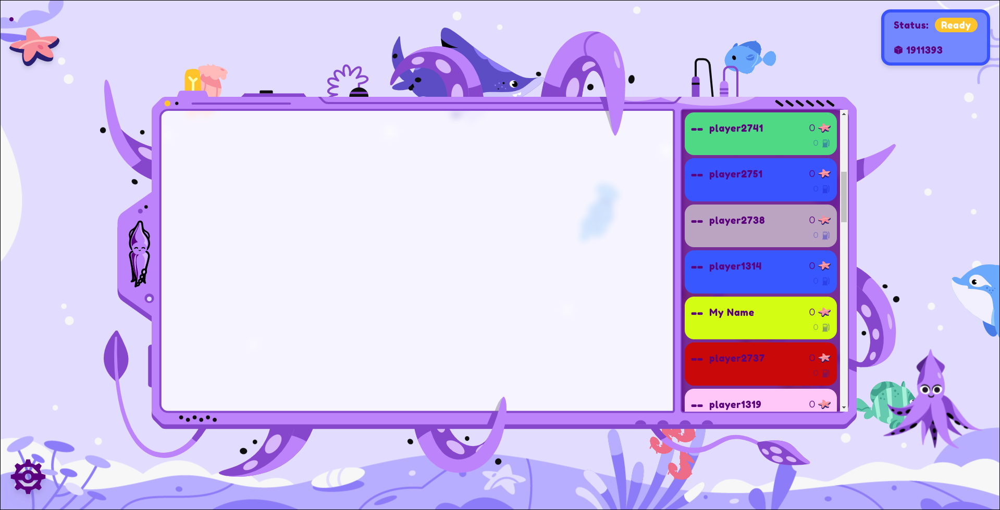
